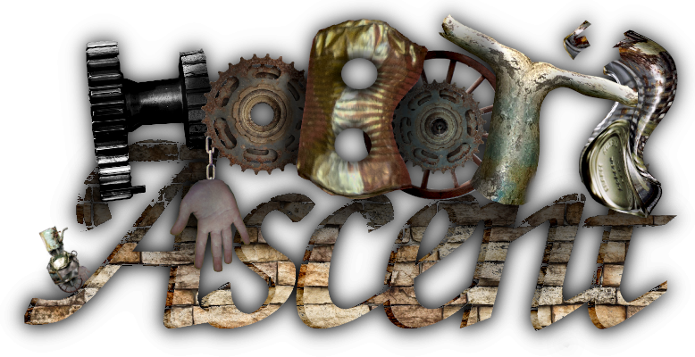

This game is made for [PyWeek 28](https://pyweek.org/) "Tower".

To run the game, run:

    python3 run_game.py

The only keys you need are the arrow keys and the enter key.

To toggle windowed/fullscreen, press alt+enter or F11.  To make a screenshot,
press F12.

Acknowledgements
================

Artwork by [@rdb](https://github.com/rdb) and [@momojohobo](https://github.com/momojohobo)

Animations by [@momojohobo](https://github.com/momojohobo)

Programming by [@rdb](https://github.com/rdb)

Music and sound effects by [@momojohobo](https://github.com/momojohobo)

Raw source textures from https://free-images.com/ in the public domain.

Raw sound effects from https://freesound.org/ in the public domain.

Thanks to the authors and contributors of the GIMP and Blender.

Many thanks to lordmauve for facilitating PyWeek and to all the other participants!

License
=======

This code is placed in the public domain.
